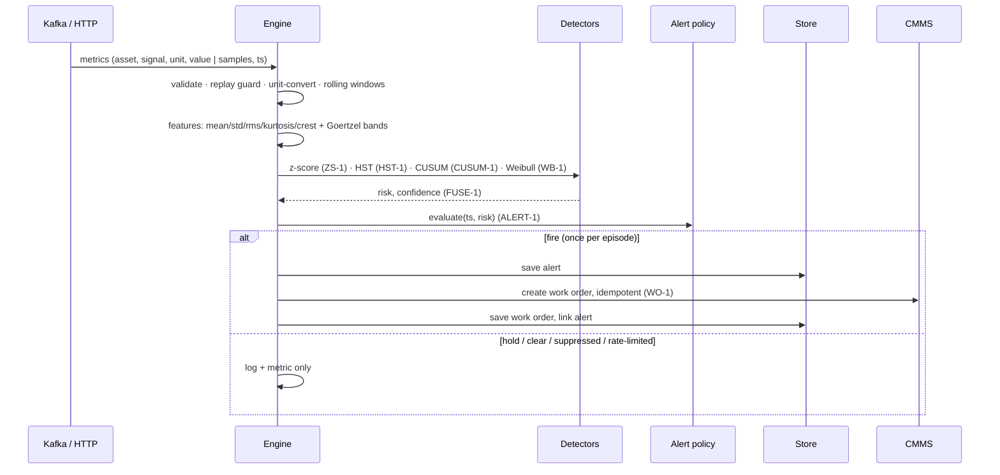

# predictmaint

> Predictive maintenance at fleet scale: asset-class templates, deterministic anomaly + Weibull risk fusion, nuisance-proof alerting with technician feedback, and CMMS work orders. Go, Kafka, Postgres, Kubernetes.


[](https://github.com/udaykishore-resu/predictmaint/actions/workflows/ci.yaml)

## Problem

Almost every manufacturer has run a predictive-maintenance pilot, and almost none has rolled one out. The pilot works: a data scientist fits a model to ten pumps, catches a bearing fault, and the slide deck writes itself. Then the programme is asked to cover a thousand machines across five plants, and it stalls. A model per machine cannot be retrained, validated or explained at that scale; nobody owns the ten-thousandth threshold; and the "model" quietly degrades into a spreadsheet of hand-tuned limits.

The second killer is nuisance alerts. Detection is easy; deciding when to *tell someone* is hard. A detector that pages a technician fifty times while one bearing degrades, or that trips on a sensor cable every Monday, teaches the maintenance crew to ignore the system within a month. Once trust is gone, the work-order queue fills with unread "predictive" tickets and the programme is judged a failure regardless of its recall.

Both failures have resisted fixes because they are treated as modelling problems. They are platform problems: how to share a monitoring recipe across a class of machines while letting each one learn its own normal, and how to turn a risk score into a small number of trusted, actionable, de-duplicated work orders.

## Approach

`predictmaint` implements **asset-class-templated anomaly detection** with a **deterministic decision core**:

- A **template per asset class** (`pump`, `motor`, `compressor`, ...) fixes signals, unit handling, feature recipe, detector hyperparameters, a Weibull failure prior, fusion weights, alert policy and work-order policy. Adding a machine costs nothing; adding a class is a template review.
- An **asset learns only baselines** (median/MAD per feature) during a warm-up window plus a bounded threshold offset from technician feedback. Cold start transfers the class baselines, so a freshly commissioned pump is monitored from its first snapshot.
- **Detectors are pure Go and closed-form**: robust z-score with MAD, streaming Half-Space Trees, two-sided CUSUM for drift, and a Weibull class prior, fused into one risk score. Every rule has a version (`ZS-1`, `HST-1`, `CUSUM-1`, `WB-1`, `FUSE-1`, `ALERT-1`, `ADAPT-1`, `WO-1`) that is logged with every decision, so "why did this fire?" is answerable from the alert record.
- The **alerting policy engine** is where trust is manufactured: hysteresis, minimum persistence, post-clear suppression, per-asset and per-site rate limits, and **false-alarm tracking** from confirm/dismiss feedback that adapts each asset's threshold within guardrails. One degrading bearing yields one alert.
- **CMMS integration** sits behind a small interface with a simulated implementation and Maximo / SAP PM payload mappers. A work order is created only above a confidence threshold, is idempotent on `asset|failure_mode|alert`, and is de-duplicated against open work orders for the same asset and failure mode.

ML is confined to scoring. Nothing that decides whether a human is interrupted is learned.

## Architecture

```mermaid
flowchart LR
  subgraph Plant
    GW[Edge gateway / plantstream]
  end
  subgraph predictmaint
    K[Kafka consumer<br/>franz-go] --> E
    H[HTTP API<br/>net/http] --> E
    E[Engine<br/>features → detectors → fusion → policy → work orders]
    E --> S[(Store<br/>memory | PostgreSQL)]
    E --> C[CMMS port<br/>simulated | Maximo/SAP PM mappers]
    E --> O[Observability<br/>slog JSON · Prometheus · OTel]
  end
  GW -- uns.metrics --> K
  GW -- POST /v1/metrics --> H
  T[Technician] -- feedback, health, alerts --> H
  R[Reliability engineer] -- PUT /v1/templates --> H
```

Hot path for one asset snapshot:



More in [docs/architecture.md](docs/architecture.md).

## Quick start

Requires Go 1.26+. No Docker, no brokers, no database.

```bash
make run          # in-memory store, simulated CMMS, HTTP on :8080
```

In a second shell, stream the canonical scenario: five identical pumps, `pump-003` develops an outer-race bearing defect from snapshot 60.

```bash
make simulate
# simulating 5 pumps at plant-a, 160 snapshots x 5m0s; pump-003 develops a bearing fault from step 60
# step  30: ... risk=0.007 ... baseline=class
# step  40: ... risk=0.065 ... baseline=asset        <- per-asset baselines learned
# step  66: ALERT fired (1), work orders created: 1  <- severity 0.09, one alert
# step  70..150: risk=0.85..0.66 state=active         <- stays active, never re-alerts
# done: 160 snapshots, 1 alerts, 1 work orders
```

Then walk the API:

```bash
# 1. Ingest a hand-written batch. Units are converted to the template's canonical units (F -> C, psi -> bar).
#    It carries the same timestamps as the simulator's first snapshot, so after `make simulate` the replay
#    guard reports it as duplicates; on a fresh server it reports accepted:5. Either way nothing is double-counted.
curl -s -X POST localhost:8080/v1/metrics -H 'content-type: application/json' --data @examples/metrics_batch.json
# {"accepted":0,"rejected":0,"duplicates":5,"evaluations":0,"alerts_fired":0,"work_orders_created":0}

# 2. Health of the degrading pump: fused risk, detector outputs, top contributors, learned threshold.
curl -s localhost:8080/v1/assets/pump-003/health | jq '{risk, alert_state, baseline_source, effective_threshold, top: .top_contributors[0]}'
# {"risk":0.654,"alert_state":"active","baseline_source":"asset","effective_threshold":0.6,"top":{"feature":"vibration.rms","z":101.4,...}}

# 3. Alerts for the site: exactly one, with the rules that fired.
curl -s 'localhost:8080/v1/alerts?site=plant-a' | jq '{count, asset: .alerts[0].asset_id, failure_mode: .alerts[0].failure_mode, rules: .alerts[0].rules}'
# {"count":1,"asset":"pump-003","failure_mode":"bearing_wear","rules":["ZS-1","HST-1","CUSUM-1","WB-1","FUSE-1","ALERT-1"]}

# 4. The work order it raised in the (simulated) CMMS.
curl -s 'localhost:8080/v1/workorders?asset_id=pump-003' | jq '.work_orders[0] | {id, failure_mode, confidence, external, rule}'
# {"id":"...","failure_mode":"bearing_wear","confidence":0.85,"external":{"system":"simulated","id":"WO-000001"},"rule":"WO-1"}

# 5. Technician feedback tightens the asset's threshold within guardrails and records MTTA.
ALERT=$(curl -s 'localhost:8080/v1/alerts?site=plant-a' | jq -r '.alerts[0].id')
curl -s -X POST localhost:8080/v1/alerts/$ALERT/feedback -H 'content-type: application/json' --data @examples/feedback_confirm.json | jq .adaptation
# {"verdict":"confirm","offset_before":0,"offset_after":-0.02,"threshold_before":0.6,"threshold_after":0.58,"clamped":false,"rule":"ADAPT-1"}
curl -s 'localhost:8080/v1/stats?site=plant-a'
# {"site":"plant-a","total_alerts":1,"confirmed":1,"alerts_per_day":1,"precision_proxy":1,"mtta_seconds":...}

# 6. Tune the class template live; assets of the class are rebuilt, learned baselines survive.
curl -s -X PUT localhost:8080/v1/templates/pump -H 'content-type: application/json' --data @examples/template_pump_tuned.json | jq '{version, on: .alerting.on_threshold}'
```

`make demo` runs all of the above as a script ([examples/demo.sh](examples/demo.sh)). `make run-full` brings up Kafka (KRaft), PostgreSQL and an OTel collector with docker compose and runs the service against them.

### Ingest contract

A metric is one reading of one signal on one asset. Slow process variables are scalars; high-frequency channels are sent as a **burst** of samples taken at one timestamp, so a 1 kHz vibration snapshot is one message, not 256.

```json
{"asset_id":"pump-001","site":"plant-a","asset_class":"pump","signal":"vibration","unit":"mm/s",
 "samples":[0.91,0.12,-0.77,...],"ts":"2026-03-01T06:00:00Z"}
```

`asset_class` is required the first time an asset is seen. Kafka records may carry the asset id as the key. Replays are safe: anything not newer than the last accepted timestamp for the same asset and signal is a duplicate. The full API is in [api/openapi.yaml](api/openapi.yaml).

## Configuration

| Variable | Default | Description |
|---|---|---|
| `HTTP_ADDR` | `:8080` | Listen address |
| `LOG_LEVEL` | `info` | `debug` / `info` / `warn` / `error` |
| `LOG_FORMAT` | `json` | `json` / `text` |
| `ENVIRONMENT` | `dev` | Reported in logs and traces |
| `STORE_BACKEND` | `memory` | `memory` / `postgres` |
| `POSTGRES_DSN` | | Required when `STORE_BACKEND=postgres` |
| `MIGRATIONS_DIR` | `migrations` | SQL migrations applied at startup (postgres) |
| `CMMS_BACKEND` | `simulated` | CMMS adapter (Maximo / SAP PM mappers ship; HTTP transports are roadmap) |
| `WORKORDER_RETRIES` | `5` | CMMS retries per alert episode after a failure |
| `KAFKA_ENABLED` | `false` | Consume `KAFKA_TOPIC` |
| `KAFKA_BROKERS` | `localhost:9092` | Comma-separated seed brokers |
| `KAFKA_TOPIC` | `uns.metrics` | Metrics topic |
| `KAFKA_GROUP` | `predictmaint` | Consumer group |
| `HTTP_MAX_BODY_BYTES` | `16777216` | Request body cap |
| `HTTP_READ_TIMEOUT` / `HTTP_WRITE_TIMEOUT` | `15s` / `30s` | Server timeouts |
| `SHUTDOWN_TIMEOUT` | `20s` | Drain window on SIGTERM |
| `OTEL_EXPORTER_OTLP_ENDPOINT` | | OTLP/HTTP `host:port`; empty disables trace export |
| `OTEL_EXPORTER_OTLP_INSECURE` | `true` | Plain HTTP to the collector |
| `OTEL_TRACES_SAMPLER_ARG` | `1.0` | Parent-based ratio sampler |

## Operations

**SLOs** (details and alert rules in [docs/runbook.md](docs/runbook.md)): ingest availability 99.9%, p99 ingest latency < 250 ms, alert precision proxy ≥ 0.7 per site, ≤ 0.2 alerts/asset/day, MTTA < 4 h.

**Metrics** (`/metrics`, Prometheus): `predictmaint_metrics_ingested_total{result}`, `predictmaint_evaluations_total{class}`, `predictmaint_risk_score{class}`, `predictmaint_alert_outcomes_total{site,class,outcome}`, `predictmaint_work_orders_total{site,class,result}`, `predictmaint_feedback_total{class,verdict}`, `predictmaint_precision_proxy{site}`, `predictmaint_alerts_per_day{site}`, `predictmaint_mtta_seconds{site}`, `predictmaint_assets_tracked`, `predictmaint_kafka_batches_total{result}`, plus RED (`predictmaint_http_requests_total`, `predictmaint_http_request_duration_seconds`, `predictmaint_http_requests_in_flight`).

**Health**: `/healthz` liveness, `/readyz` checks the store and (when enabled) Kafka. Logs are JSON with `request_id`, `trace_id`, rule versions and decision reasons. Traces export via OTLP/HTTP.

**Dashboards**: fleet (risk histogram, top assets, open alerts), programme health (alerts/day, precision proxy, MTTA, verdicts), service (RED, Kafka, runtime).

**Scaling model**: assets are keyed in Kafka by `asset_id`; a consumer group of N replicas splits the fleet N ways and each replica holds state only for its assets (~100-150 KB per asset, ~2000 assets per 512 MiB pod). Learned baselines and threshold offsets are persisted as snapshots, so a restart or rebalance costs one window of samples, not a new cold start. The Helm chart in [deploy/helm/predictmaint](deploy/helm/predictmaint) ships HPA, PDB, NetworkPolicy, ServiceMonitor toggle, non-root read-only containers and an external-secret contract.

## Design decisions

- [ADR-0001 Asset-class templates with a deterministic per-asset pipeline](docs/adr/0001-architecture.md)
- [ADR-0002 Data model and persistence boundaries](docs/adr/0002-data-model.md)
- [ADR-0003 Failure handling, idempotency and back-pressure](docs/adr/0003-failure-handling.md)
- [ADR-0004 Detector choice and scaling model](docs/adr/0004-key-tradeoff-detectors-and-scale.md)

## Roadmap

- Real CMMS transports (Maximo OSLC, SAP PM OData) behind the existing `CMMS` interface; the payload mappers are done, the HTTP clients and auth are not.
- Slow baseline re-learning (EWMA on median/MAD) so seasonal drift does not require a template touch.
- Per-asset state checkpoints for zero-warm-up rebalances.
- Envelope/demodulation features for early-stage bearing faults hidden under shaft harmonics.
- Alert routing (webhook / Slack) with the same suppression semantics.

## GitHub topics

`Topics: go, kubernetes, kafka, postgresql, predictive-maintenance, anomaly-detection, industrial-iot, manufacturing, cmms, opentelemetry, prometheus, event-driven`

## Skills demonstrated

- Platform engineering: ports-and-adapters Go service that runs with zero infrastructure and scales on Kafka partitions
- Event-driven design with at-least-once consumption and idempotent processing end to end (replay guards, upserts, idempotency keys, database backstops)
- Streaming signal processing in pure Go: rolling statistics, Goertzel band energy, unit-safe conversion
- Deterministic decision engineering: versioned rules, auditable alerts, guard-railed feedback loops
- Robust statistics and streaming anomaly detection (MAD z-scores, Half-Space Trees, CUSUM, Weibull priors, score fusion)
- Test design: table-driven units, golden vendor payloads, property test (Goertzel vs. DFT), fuzz tests, end-to-end scenario from a physics-based simulator
- Production readiness: slog JSON with request/trace ids, Prometheus RED + domain metrics, OpenTelemetry, graceful shutdown, Helm with security context, PDB, HPA, NetworkPolicy, CI with lint, race tests, govulncheck and image build
- Operational writing: ADRs, runbook with SLOs and failure playbooks, OpenAPI 3.1

## License

Apache-2.0. Copyright 2026 Udaykishore Resu.
