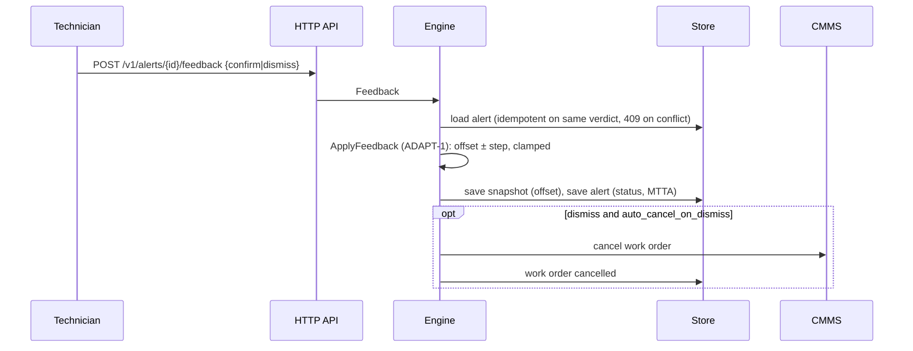

# Architecture

## Containers

```mermaid
flowchart LR
  subgraph Plant
    GW[Edge gateway / plantstream]
  end
  subgraph predictmaint
    K[Kafka consumer<br/>franz-go] --> E
    H[HTTP API<br/>net/http] --> E
    E[Engine<br/>features → detectors → fusion → policy → work orders]
    E --> S[(Store<br/>memory | PostgreSQL)]
    E --> C[CMMS port<br/>simulated | Maximo/SAP PM mappers]
    E --> O[Observability<br/>slog JSON · Prometheus · OTel]
  end
  GW -- uns.metrics --> K
  GW -- POST /v1/metrics --> H
  T[Technician / UI] -- feedback, health, alerts --> H
  R[Reliability engineer] -- PUT /v1/templates --> H
  O --> P[Prometheus / Grafana]
  O --> J[OTLP collector]
```

## Hot path

```mermaid
sequenceDiagram
  participant Src as Kafka/HTTP
  participant Eng as Engine
  participant Asset as Asset state
  participant Det as Detectors
  participant Pol as Alert policy
  participant St as Store
  participant CM as CMMS

  Src->>Eng: batch of metrics (asset, signal, unit, value|samples, ts)
  Eng->>Eng: validate, group by asset, sort by ts
  loop per asset, per distinct ts
    Eng->>Asset: replay guard (ts > high-water mark per signal)
    Eng->>Asset: unit-convert, push into rolling windows
    Eng->>Asset: extract features (mean/std/rms/kurtosis/crest, Goertzel bands)
    alt warm-up complete
      Asset->>Asset: fit median/MAD baselines, re-anchor HST, reset CUSUM
      Eng->>St: save asset snapshot
    end
    Eng->>Det: robust z (ZS-1), HST (HST-1), CUSUM (CUSUM-1), Weibull (WB-1)
    Det-->>Eng: fused risk + confidence (FUSE-1)
    Eng->>Pol: evaluate(ts, risk) (ALERT-1)
    alt fire
      Eng->>St: save alert
      Eng->>St: find open work order (asset, failure_mode)
      Eng->>CM: create work order (idempotency key) (WO-1)
      Eng->>St: save work order, link alert
    else clear
      Eng->>St: mark alert cleared; start suppression window
    else suppressed / rate-limited
      Eng->>Eng: log + metric, no alert
    end
  end
  Src->>Eng: (Kafka) commit offsets after success
```

## Feedback loop



## Packages

| Path | Role |
|---|---|
| `internal/domain/features` | Ring windows, time-domain stats, Goertzel, unit conversion, extractor |
| `internal/domain/detect` | Robust z-score + baselines, Half-Space Trees, CUSUM, Weibull, fusion |
| `internal/domain/alerting` | Alert policy state machine, rate limiter, feedback adaptation, stats |
| `internal/domain/cmms` | Work order model/policy, CMMS port, simulated CMMS, Maximo & SAP PM mappers |
| `internal/domain/template` | Class templates, validation, built-in defaults |
| `internal/domain/engine` | Orchestration, per-asset state, persistence of durable facts |
| `internal/domain/metric` | Ingest contract and validation |
| `internal/ports` | Store, MetricSource interfaces |
| `internal/adapters/{memory,postgres,kafka}` | Port implementations |
| `internal/api/http` | Handlers, middleware, server lifecycle |
| `internal/observability` | slog, Prometheus, OpenTelemetry |
| `internal/sim` | Bearing-degradation fleet simulator (tests and demo) |
